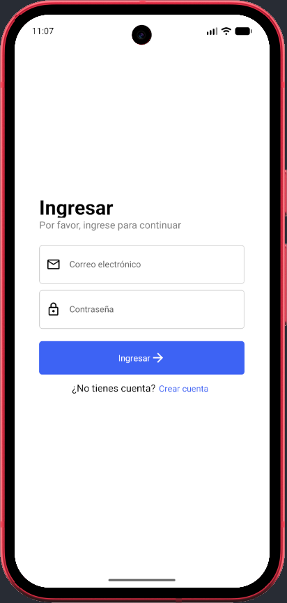
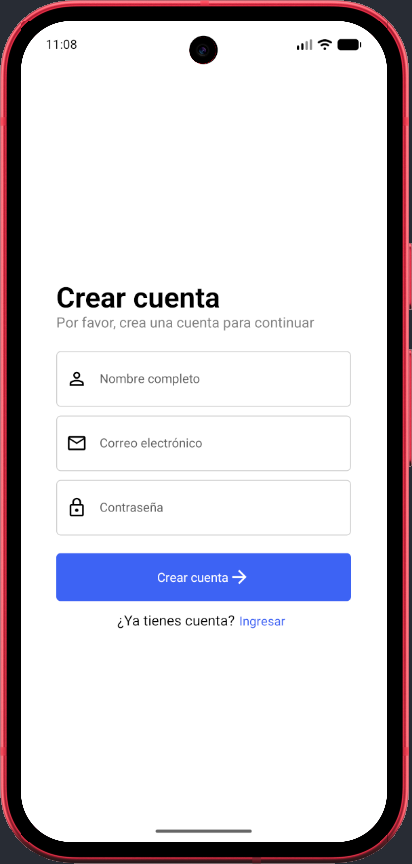
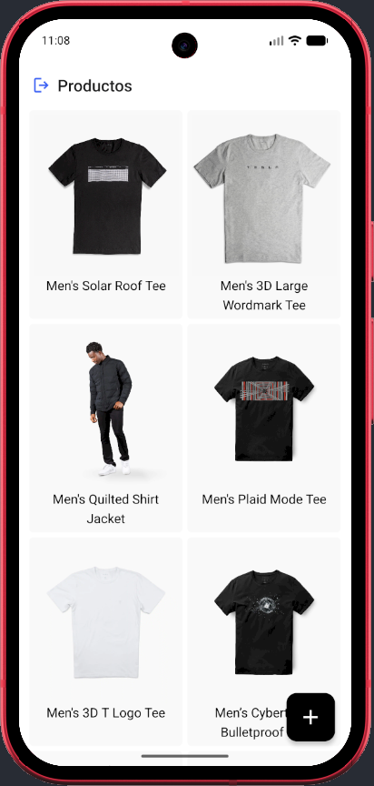
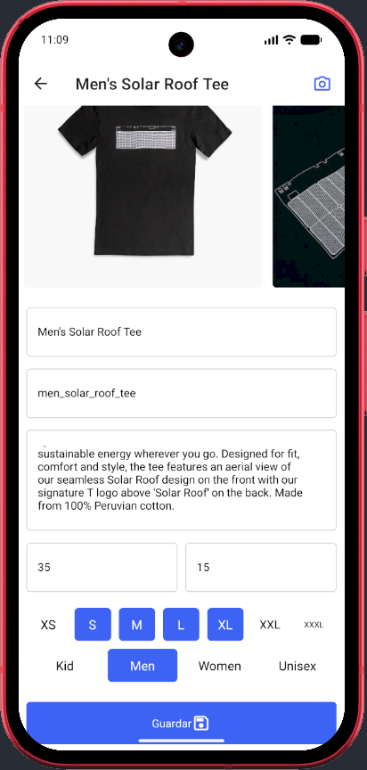
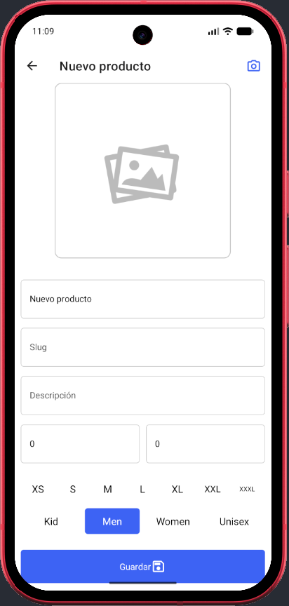
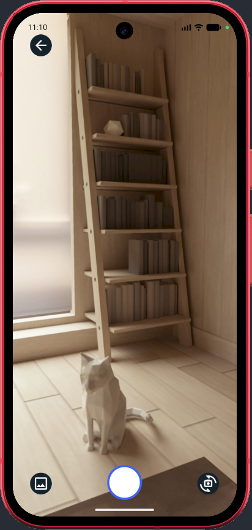

# Products App

This is an [Expo](https://expo.dev) project created with [`create-expo-app`](https://www.npmjs.com/package/create-expo-app).

## Get started

1. Install dependencies

   ```bash
   bun i
   ```

2. Clone `.env.template` to `.env` and change the IP address.

3. Start the app

   ```bash
   bun start
   ```

## Screenshots







